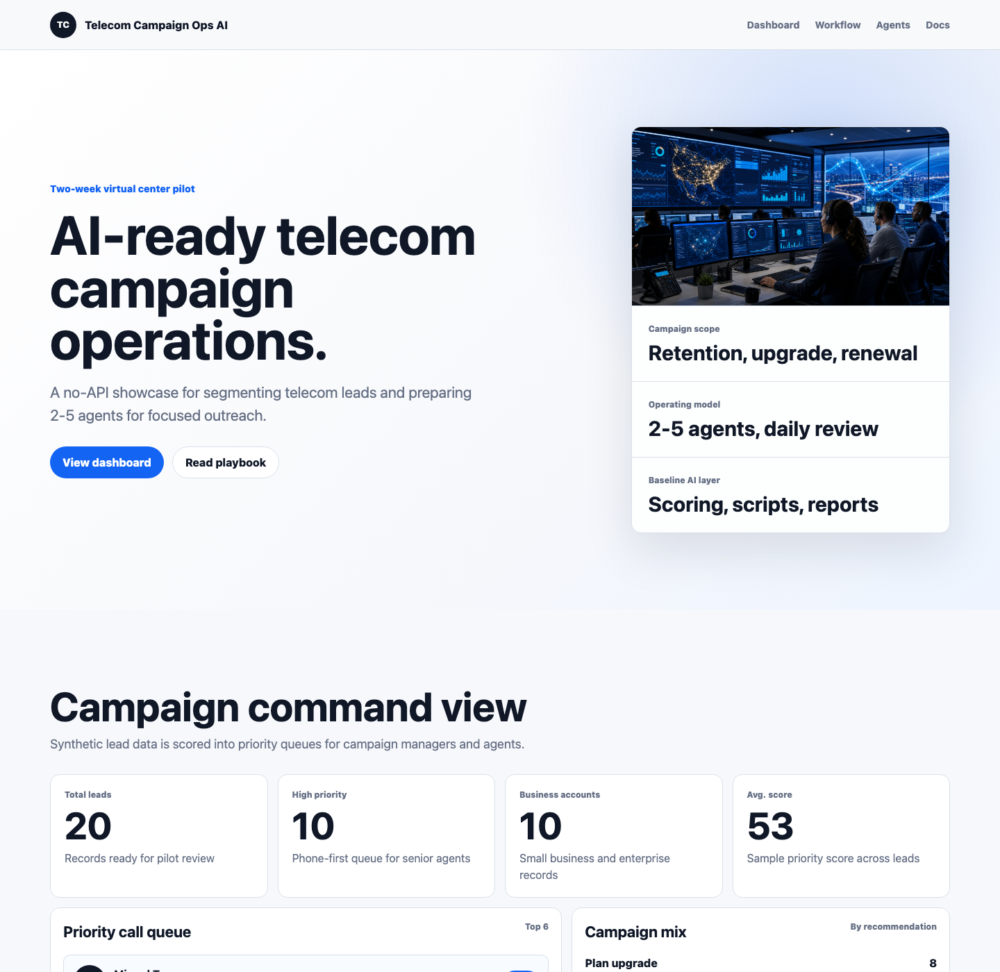

# Telecom Campaign Ops AI

AI-assisted telecom campaign operations pilot for a virtual contact center.

This repository is a portfolio-grade project showing how a two-week pilot campaign can be designed for a 2-5 agent virtual center. It combines synthetic telecom customer data, lead segmentation, agent scripts, follow-up workflows, KPI reporting, and a static executive dashboard.



## Project Goal

Help a virtual center launch a telecom campaign with clearer agent guidance, structured customer segments, CRM-ready follow-up status, and manager visibility.

The project is intentionally built without paid APIs. The first version uses deterministic scoring and documented prompt templates so the workflow is transparent, runnable, and safe to share publicly.

## Live Dashboard

Open `index.html` locally or publish this repository with GitHub Pages.

## What This Demonstrates

- Telecom campaign strategy for acquisition, upgrade, and churn prevention.
- Synthetic customer data preparation and segmentation.
- Rule-based campaign scoring for agent prioritization.
- Agent call scripts, objections, and follow-up recommendations.
- Manager-facing KPI report generation.
- Two-week pilot planning for a 2-5 agent virtual center.

## Repository Structure

```text
.
├── index.html
├── styles.css
├── script.js
├── data/
│   ├── synthetic_telecom_leads.csv
│   └── campaign_segments.csv
├── docs/
│   ├── agent_onboarding.md
│   ├── campaign_playbook.md
│   ├── kpi_framework.md
│   └── two_week_pilot_plan.md
├── outputs/
│   ├── sample_agent_scripts.md
│   └── sample_manager_report.md
└── scripts/
    ├── generate_agent_brief.py
    └── segment_leads.py
```

## Run Locally

```bash
python3 scripts/segment_leads.py
python3 scripts/generate_agent_brief.py
python3 -m http.server 8000
```

Then open:

```text
http://localhost:8000
```

## Data Disclaimer

All customer, agent, company, and campaign data in this repository is synthetic and created for demonstration. It must not be interpreted as real customer data, real telecom performance, or guaranteed campaign outcomes.

## Portfolio Positioning

This project is designed to showcase practical AI operations thinking: data structure first, human-readable workflows, measurable KPIs, and a safe path from pilot to scale.
